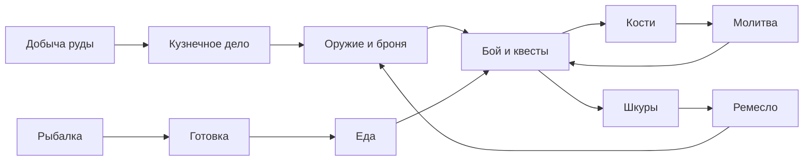

# OSRS: гайд для новичка и плагины RuneLite

Sep 25, 2026 · @Mark

Полный путь в Old School RuneScape для бесплатной версии: от первого шага после обучающего острова до рунической брони после Dragon Slayer I. Иди по «Пошаговому плану», а разделы навыков открывай, когда шаг отправляет туда за подробностями.

**Начало**

1. Вход и настройка
2. Бесплатная версия или подписка
3. Пошаговый план: Цели по этапам · Этап 1 · Этап 2 · Этап 3 · Этап 4 · Этап 5 · Этап 6

**Навыки**

4. Как устроена прокачка
5. Мирные: Рубка · Костры · Рыбалка · Готовка · Добыча руды · Кузнечное дело · Ремесло · Создание рун
6. Боевые: Ближний бой · Дальний бой · Магия · Молитва

**Справка**

7. Плагины RuneLite
8. Советы и безопасность
9. Ссылки на вики
10. Для программы-трекера

## Вход и настройка

В игру с Jagex-аккаунтом входят только через Jagex Launcher: логин и пароль прямо в окне клиента не работают.

1. Скачай Jagex Launcher с сайта jagex.com и войди в него почтой и паролем Jagex-аккаунта.
2. Выбери Old School RuneScape, при необходимости создай персонажа.
3. В списке клиентов выбери RuneLite и нажми Play. Дальше лаунчер помнит вход.

Графика на Dell Latitude 5420 (Intel Iris Xe):

- **GPU** — стабильные 60+ fps, оригинальная картинка. Можно поднять дальность прорисовки и включить сглаживание.
- **117 HD** — красивый свет, тени и вода. На средних настройках примерно 40–60 fps, для стабильных 60 урежь дальность прорисовки (30–40 тайлов), тени и сглаживание.
- **GPU и 117 HD одновременно не включаются**: 117 HD заменяет GPU. Включён должен быть только один из них.
- Для игры фоном ставь в **FPS Control** лимит 10–20 кадров для неактивного окна.
- Проверь, что в ноутбуке две планки памяти (двухканальный режим), играй от сети в режиме максимальной производительности.
- AFK-таймер выхода в настройках клиента можно увеличить до 30 минут.

## Бесплатная версия или подписка

Сразу покупать подписку не нужно: бесплатной версии хватит на десятки часов, и весь гайд выше проходится бесплатно.

|  | Бесплатно | С подпиской |
| --- | --- | --- |
| Карта | Примерно четверть мира: Лумбридж, Варрок, Фалладор, Draynor, Эдгвилль | Весь мир |
| Навыки | 15: бой, рубка, рыбалка, готовка, добыча, кузнечное дело, костры, ремесло, руны | Плюс Agility, Thieving, Herblore, Farming, Slayer, Construction и другие |
| Квесты | Около двух десятков | Больше ста пятидесяти |
| Броня | До рунной | Драконья и выше |

- Когда подписка заканчивается, прогресс сохраняется, закрываются только members-навыки и зоны.
- Подписку можно купить игровым золотом через **Old School Bond** на Grand Exchange.
- Актуальную цену смотри на сайте Jagex.

## Пошаговый план: от острова до рунической брони

Это основной маршрут всего гайда. Иди по шагам сверху вниз и отмечай галочки. Когда шаг говорит «качай навык до N», подробности (где, что нужно, частые вопросы) — в разделе этого навыка ниже.

Цель плана — квест **Dragon Slayer I**: после него можно носить рунический нагрудник, и персонаж готов к подземельям. Мирные навыки здесь работают на бой: дают еду, броню, оружие и молитву.

### Как навыки кормят друг друга



### Если не знаешь, что делать

1. **Есть квест из текущего этапа?** Делай его: квесты дают опыт, деньги и очки квестов (Quest Points), без которых не открыть Dragon Slayer I.
2. **Меньше 20 штук еды в банке?** Порыбачь и приготовь.
3. **Можно надеть металл получше?** Выкуй или купи.
4. **Бой отстаёт от мирных навыков?** Иди в бой.
5. **Иначе** — любой мирный навык, который сейчас нравится.

Хороший ритм: 30–40 минут боя, потом 30–40 минут мирного навыка. Не надоедает, и ресурсы копятся сами.

Перед стартом включи плагин **Quest Helper** (см. «Плагины RuneLite»): он проведёт по каждому квесту из плана.

### Как читать шаги

Каждый шаг устроен одинаково, чтобы его было удобно отмечать здесь и потом перенести в программу:

- **Код** вида `S2-05`: этап 2, шаг 5. Коды не меняются, по ним программа понимает, что сделано.
- **Тип**: [Квест], [Навык], [Снаряжение] или [Подготовка].
- **Где** — место старта или прокачки.
- **Взять** — что должно быть в инвентаре.
- **Награда** — что даёт шаг.
- **Готово, когда** — точное условие, после которого ставишь галочку.

В бесплатной версии 24 квеста на 46 очков квестов. Первый, Learning the Ropes, — это обучающий остров, его ты уже прошёл (1 очко). План ниже проводит по остальным 23.

### Цели по этапам

Уровни, к которым стоит прийти к концу каждого этапа. Это ориентир, а не жёсткое правило: если какой-то навык отстаёт на пару уровней, это нормально.

| Навык | Этап 1 | Этап 2 | Этап 3 | Этап 4 | Этап 5 | Этап 6 |
| --- | --- | --- | --- | --- | --- | --- |
| Атака | 10 | 20 | 30 | 40 | 40 | 50–60 |
| Сила | 10 | 20 | 30 | 40 | 44 | 50–60 |
| Защита | 10 | 20 | 30 | 40 | 44 | 50–60 |
| Дальний бой | 1 | 1 | 1 | 1 | 1 | 30–40 |
| Магия | 1 | 25 | 33 | 33 | 33 | 55 |
| Молитва | 11 | 11 | 15 | 20 | 20 | 25–43 |
| Рубка | 15 | 15 | 15 | 15 | 15 | 60 |
| Костры | 15 | 15 | 15 | 15 | 15 | 15–50 |
| Рыбалка | 20 | 30 | 30 | 40 | 40 | 50 |
| Готовка | 15 | 30 | 30 | 40 | 40 | 50 |
| Добыча руды | 15 | 15 | 30 | 30 | 30 | 60 |
| Кузнечное дело | 1 | 29 | 29 | 29 | 29 | 29 |
| Ремесло | 8 | 9 | 9 | 9 | 9 | 9–30 |
| Создание рун | 1 | 1 | 1 | 1 | 1 | 1–20 |
| Очки квестов | 6 | 32 | 41 | 44 | 46 | 46 |

На этапе 5 сила и защита вырастут сами: Dragon Slayer I даёт по 18 650 опыта в каждую. Кузнечное дело 29 даёт квест The Knight's Sword (12 725 опыта), магию 25 и 33 — тренировка в шагах S2-04 и S3-09. Значения сверены с маршрутом V2.1 на 26.09.2026.

### Этап 1. Лумбридж

**Старт:** сразу после обучающего острова, бой 3. **Время:** 3–5 часов. **Очки квестов в конце:** 6.

- [ ] **S1-01 · [Подготовка] Настрой клиент**
  - Где: RuneLite через Jagex Launcher.
  - Взять: включи плагины Quest Helper, Idle Notifier, Item Prices, Ground Items и GPU (или 117 HD).
  - Готово, когда: во вкладке квестов справа видна панель Quest Helper.
- [ ] **S1-02 · [Подготовка] Разбери инвентарь**
  - Где: банк на верхнем этаже замка Лумбридж.
  - Взять: при себе оставь топор, кирку, маленькую сеть и огниво, остальное положи в банк.
  - Готово, когда: в инвентаре только инструменты и есть место для добычи.
- [ ] **S1-03 · [Квест] Cook's Assistant**
  - Где: повар на кухне замка Лумбридж.
  - Взять: яйцо (ферма с курами), ведро молока (молочная корова, пустое ведро из общего магазина), горшок муки (пшеница с поля → мельница к северу от Лумбриджа).
  - Совет: сделай ещё 2 горшка муки — для пирога в S3-03 и хлеба в S3-09.
  - Награда: 1 очко квестов, 300 опыта готовки, плита на кухне замка, где еда реже подгорает.
  - Готово, когда: квест в журнале зелёный.
- [ ] **S1-04 · [Квест] Sheep Shearer**
  - Где: фермер Fred к северо-западу от Лумбриджа.
  - Взять: ножницы (Shears) — даст сам квест или общий магазин. Состриги 23 овцы и спряди шерсть на прялке на втором этаже замка.
  - Совет: отдай 20 клубков шерсти, а 3 лишних оставь — они понадобятся в S2-06.
  - Награда: 1 очко квестов, опыт ремесла, 60 монет.
  - Готово, когда: квест зелёный, в банке 3 клубка шерсти (Ball of wool).
- [ ] **S1-05 · [Квест] X Marks the Spot**
  - Где: Veos в пабе Лумбриджа (The Sheared Ram).
  - Взять: лопату (Spade) из общего магазина.
  - Награда: 1 очко квестов и лампа на 300 опыта — используй её на молитву (Prayer).
  - Готово, когда: квест зелёный, лампа использована.
- [ ] **S1-06 · [Квест] The Restless Ghost**
  - Где: священник Father Aereck в церкви Лумбриджа.
  - Взять: ничего особого. Череп лежит в подвале башни волшебников к югу от Draynor, там нападёт скелет — возьми 5 штук еды.
  - Награда: 1 очко квестов, 1 125 опыта молитвы — сразу около 9–11 уровня.
  - Готово, когда: квест зелёный.
- [ ] **S1-07 · [Квест] Misthalin Mystery**
  - Где: Abigale у болота к югу от Лумбриджа.
  - Взять: ничего. Это детектив в особняке без боя.
  - Награда: 1 очко квестов, ремесло около 7 уровня.
  - Готово, когда: квест зелёный.
- [ ] **S1-08 · [Навык] Бой до 10 / 10 / 10**
  - Где: курицы и коровы на фермах вокруг Лумбриджа.
  - Как: стиль Accurate до 10 атаки → Aggressive до 10 силы → Defensive до 10 защиты. Закапывай кости, коровьи шкуры собирай в банк.
  - Готово, когда: атака, сила и защита по 10, в банке 25+ коровьих шкур (Cowhide).
- [ ] **S1-09 · [Навык] Рыбалка до 20 и готовка до 15**
  - Где: креветки в болоте к югу от замка или на берегу у Draynor; готовка на плите в кухне замка.
  - Готово, когда: рыбалка 20, готовка 15, в банке 50+ готовых креветок или анчоусов.
- [ ] **S1-10 · [Навык] Рубка и костры до 15**
  - Где: обычные деревья к западу от замка Лумбридж.
  - Как: руби и сразу жги брёвна огнивом. До 15 нужно около 100 брёвен.
  - Готово, когда: рубка 15, костры 15.
- [ ] **S1-11 · [Навык] Добыча руды до 15**
  - Где: шахта на болоте к юго-востоку от Лумбриджа (медь и олово).
  - Как: копай медь и олово поровну. Отложи 4 медной руды для S3-01. Остальное выплавь в бронзу в печи Лумбриджа.
  - Готово, когда: добыча 15, в банке 4 медной руды и 15+ бронзовых слитков.

**Итог этапа:** 10 атаки, силы и защиты, около 15 в мирных навыках, 6 очков квестов, запас креветок, шкур и бронзовых слитков.

### Этап 2. Port Sarim, Варрок и Draynor

**Старт:** бой около 10. **Время:** 6–8 часов. **Очки квестов в конце:** 28.

- [ ] **S2-01 · [Квест] Rune Mysteries**
  - Где: герцог Duke Horacio на втором этаже замка Лумбридж.
  - Как: отнеси талисман магу Sedridor в подвал башни волшебников к югу от Draynor, потом посылку (Research package) — магу Aubury в магазин рун Варрока, и обратно.
  - Награда: 1 очко квестов, открывается создание рун.
  - Готово, когда: квест зелёный.
- [ ] **S2-02 · [Подготовка] Stronghold of Security**
  - Где: дыра в земле посреди Barbarian Village.
  - Как: 4 этажа, у каждой двери вопрос о безопасности аккаунта (правильный ответ почти всегда «никому не давать пароль и не верить подаркам»). Монстры внизу сильнее тебя — не дерись, пробегай от двери к двери.
  - Награда: 10 000 монет и сапоги. Этих денег хватит на все покупки для квестов.
  - Готово, когда: забрал награды на всех 4 этажах.
- [ ] **S2-03 · [Снаряжение] Покупки на Grand Exchange**
  - Где: Grand Exchange на северо-западе Варрока.
  - Взять: 4 бусины для Imp Catcher (красная, жёлтая, чёрная, белая — около 6 000 монет вместе), стальной ятаган (Steel scimitar, нужна атака 5), удочку для нахлыста (Fly fishing rod) и 500 перьев.
  - Готово, когда: всё куплено и лежит в банке.
- [ ] **S2-04 · [Квест] Romeo & Juliet**
  - Где: Ромео на площади Варрока.
  - Как: беготня между Ромео, Джульеттой (к западу от Варрока), отцом Лоуренсом и аптекарем; ягоды Cadava — у кустов у шахты к юго-востоку от Варрока.
  - Заодно: там же собери 4+ красных ягод (Redberries), в магазине одежды Thessalia на площади купи розовую юбку (Pink skirt), в шахте к юго-западу от Варрока добудь 7 глины (Clay).
  - Награда: 5 очков квестов.
  - Готово, когда: квест зелёный, в банке ягоды, юбка и глина.
- [ ] **S2-05 · [Квест] Pirate's Treasure**
  - Где: пират Redbeard Frank в Port Sarim.
  - Взять: 60 монет на лодки, лопату.
  - Как: на Karamja поработай на банановой плантации и тайком провези ром в ящике, ключ открывает сундук в пабе Blue Moon в Варроке, клад — в парке Фаладора (садовник нападёт, он слабый).
  - Заодно: на Karamja купи 3 пива у Zembo (для S2-06), в Port Sarim убей крысу ради сырого мяса (для S2-09).
  - Награда: 2 очка квестов, золотое кольцо, изумруд, монеты.
  - Готово, когда: квест зелёный.
- [ ] **S2-06 · [Квест] Prince Ali Rescue**
  - Где: Hassan во дворце Al Kharid (вход через ворота за 10 монет).
  - Взять: 4 лука, 4 красных ягоды, 15 монет, пепел (Ashes), горшок муки, ведро воды, 3 клубка шерсти, мягкую глину (глина + вода), бронзовый слиток, розовую юбку, 3 пива.
  - Как: парик у Ned в Draynor, мазь и красители у ведьмы Aggie в Draynor, отпечаток ключа у Lady Keli. Quest Helper ведёт по всем точкам.
  - Заодно: у Aggie купи 1 красный и 2 жёлтых красителя, смешай красный с жёлтым — получится оранжевый для S2-10.
  - Награда: 3 очка квестов, 700 монет, ворота в Al Kharid бесплатны навсегда.
  - Готово, когда: квест зелёный.
- [ ] **S2-07 · [Квест] Imp Catcher**
  - Где: маг Mizgog на верхнем этаже башни волшебников.
  - Взять: 4 бусины из S2-03.
  - Награда: 1 очко квестов, 875 опыта магии.
  - Готово, когда: квест зелёный.
- [ ] **S2-08 · [Квест] Ernest the Chicken**
  - Где: Veronica у особняка Draynor Manor.
  - Как: головоломка с рычагами в подвале и три детали машины. Quest Helper подскажет порядок рычагов.
  - Заодно: на выходе из особняка забери бронзовый средний шлем (Bronze med helm) — нужен в S3-06.
  - Награда: 4 очка квестов, 300 монет.
  - Готово, когда: квест зелёный, шлем в банке.
- [ ] **S2-09 · [Квест] Witch's Potion**
  - Где: ведьма Hetty в Rimmington.
  - Взять: лук, глаз тритона (Eye of newt, магазин Betty в Port Sarim), подгоревшее мясо (сожги сырое на костре), крысиный хвост (с крысы рядом).
  - Награда: 1 очко квестов, опыт магии.
  - Готово, когда: квест зелёный.
- [ ] **S2-10 · [Квест] Goblin Diplomacy**
  - Где: деревня гоблинов к северу от Фаладора.
  - Взять: оранжевый краситель из S2-06, синий краситель (листья Woad у садовника в парке Фаладора → Aggie), 3 гоблинские кольчуги (Goblin mail) с гоблинов в деревне.
  - Награда: 5 очков квестов, опыт ремесла, золотой слиток.
  - Готово, когда: квест зелёный.
- [ ] **S2-11 · [Навык] Бой до 20 / 20 / 20**
  - Где: гоблины к востоку от Лумбриджа → воины во дворце Al Kharid (после S2-06 вход бесплатный).
  - Как: тот же порядок стилей — атака, сила, защита. С 20 атаки купи мифриловый ятаган (Mithril scimitar).
  - Готово, когда: атака, сила и защита по 20, в руках мифриловый ятаган.
- [ ] **S2-12 · [Навык] Рыбалка до 30, готовка до 30**
  - Где: форель и лосось нахлыстом на реке в Barbarian Village или на реке у Лумбриджа.
  - Готово, когда: рыбалка 30, готовка 30, в банке 100+ приготовленного лосося или форели.
- [ ] **S2-13 · [Навык] Рубка и костры до 30**
  - Где: дубы у банка Draynor или к юго-западу от западного банка Варрока. От 15 до 30 нужно около 300 дубов.
  - Готово, когда: рубка 30, костры 30.
- [ ] **S2-14 · [Навык] Добыча руды до 20**
  - Где: железо в шахте к юго-востоку от Варрока.
  - Как: отложи 2 железной руды для S3-01.
  - Готово, когда: добыча 20, в банке 2 железной руды.

**Итог этапа:** 20 атаки, силы и защиты, мифриловый ятаган, 30 рыбалки, запас лосося, 28 очков квестов.

### Этап 3. Своё снаряжение и боевые квесты

**Старт:** бой около 20. **Время:** 8–12 часов. **Очки квестов в конце:** 41 — Dragon Slayer I (нужно 32) уже открыт.

- [ ] **S3-01 · [Квест] Doric's Quest**
  - Где: гном Doric к северу от Фаладора.
  - Взять: 6 глины, 4 медной руды, 2 железной руды (всё уже в банке с прошлых этапов).
  - Заодно: по дороге сорви капусту на ферме у Фаладора — нужна в S3-06. Капуста из Draynor Manor не подходит.
  - Награда: 1 очко квестов, опыт добычи руды, доступ к наковальням Дорика.
  - Готово, когда: квест зелёный.
- [ ] **S3-02 · [Навык] Добыча руды до 30**
  - Где: железо к юго-востоку от Варрока или в Al Kharid.
  - Как: копай железо, стоя между 2–3 камнями, и выбрасывай руду, когда инвентарь полный (быстрее всего), или складывай в банк для кузнечки.
  - Готово, когда: добыча 30, в банке 50+ железной руды.
- [ ] **S3-03 · [Квест] The Knight's Sword**
  - Где: оруженосец во дворе замка Фаладора.
  - Нужно: добыча 10, готовка 10 (чтобы испечь пирог) — или купи пирог на GE.
  - Взять: пирог из красных ягод (Redberry pie), 2 железных слитка, кирку, еду. Портрет лежит в шкафу Sir Vyvin наверху замка — бери, когда он не смотрит.
  - Опасно: синюю руду (Blurite ore) копаешь в ледяном подземелье к югу от Port Sarim. Там ледяные воины и великаны сильнее тебя — возьми 10 штук еды, скопай руду и сразу уходи.
  - Награда: 1 очко квестов, 12 725 опыта кузнечного дела — сразу 29 уровень.
  - Готово, когда: квест зелёный, кузнечное дело 29.
- [ ] **S3-04 · [Снаряжение] Кузнечное дело до 34 и свой железный комплект**
  - Где: наковальня к югу от западного банка Варрока (ближайшая к банку).
  - Как: 29 → 33 — бронзовые нагрудники из запаса бронзы; с 33 выкуй себе железный комплект: полный шлем, кайтовый щит, поножи, нагрудник. Железо выплавляй в Эдгвилле (ближайшая к банку печь), слиток выходит примерно в половине случаев.
  - Зачем 34: с этого уровня можно сковать стальные гвозди для Dragon Slayer I.
  - Готово, когда: кузнечное дело 34, железный комплект надет или в банке.
- [ ] **S3-05 · [Квест] Vampyre Slayer**
  - Где: Morgan в Draynor Village.
  - Взять: молот, кол от Dr Harlow в пабе Blue Moon в Варроке (угости его пивом), чеснок из шкафа наверху в доме Morgan, 10+ лосося.
  - Опасно: граф Draynor уровня 34. Если бой тяжёлый, используй безопасную точку (safespot) — Quest Helper её покажет.
  - Награда: 3 очка квестов, 4 825 опыта атаки.
  - Готово, когда: квест зелёный.
- [ ] **S3-06 · [Квест] Black Knights' Fortress**
  - Где: Sir Amik Varze в замке Фаладора. Нужно 12 очков квестов.
  - Взять: железную кольчугу (Iron chainbody — можно выковать самому), бронзовый средний шлем из S2-08, капусту из S3-01.
  - Награда: 3 очка квестов, 2 500 монет.
  - Готово, когда: квест зелёный.
- [ ] **S3-07 · [Квест] Shield of Arrav (необязательный)**
  - Где: Reldo в библиотеке дворца Варрока.
  - Внимание: исторически квест требует второго игрока из другой банды. Проверь условия в Quest Helper; если напарника нет — пропусти, для Dragon Slayer I очков хватает и без него.
  - Награда: 1 очко квестов, 600 монет.
  - Готово, когда: квест зелёный или осознанно пропущен.
- [ ] **S3-08 · [Квест] Demon Slayer**
  - Где: гадалка Gypsy Aris на площади Варрока.
  - Как: три ключа для меча Silverlight — у капитана Rovin (дворец Варрока), в водостоке кухни дворца (вылей туда ведро воды) и у мага Traiborn (просит 25 костей).
  - Опасно: демон Delrith уровня 27 у каменного круга к югу от Варрока. Бей только мечом Silverlight и возьми 10 штук еды.
  - Награда: 3 очка квестов, меч Silverlight.
  - Готово, когда: квест зелёный.
- [ ] **S3-09 · [Квест] Below Ice Mountain**
  - Где: на Ice Mountain к западу от монастыря Эдгвилля, Quest Helper покажет точку. Нужно 16 очков квестов.
  - Взять: хлеб (из муки S1-03), приготовленное мясо, нож (Knife).
  - Награда: 1 очко квестов, доступ к шахтам Camdozaal.
  - Готово, когда: квест зелёный.
- [ ] **S3-10 · [Навык] Бой до 30 / 30 / 30**
  - Где: воины во дворце Al Kharid.
  - Как: с 30 атаки — адамантовый ятаган, с 30 защиты — адамантовая броня (купи на GE: своя кузнечка до адаманта не дорастёт).
  - Готово, когда: атака, сила и защита по 30, надет адамант.
- [ ] **S3-11 · [Навык] Магия до 20**
  - Где: коровы или гоблины у Лумбриджа.
  - Как: Wind Strike → Water → Earth → Fire Strike, каждое новое заклинание сразу меняй. Руны у Aubury в Варроке, посох воздуха (Staff of air) экономит руны воздуха.
  - Готово, когда: магия 20.
- [ ] **S3-12 · [Навык] Молитва до 25 и ремесло до 10**
  - Как: закапывай все кости из боя. Шкуры из S1-08 выдели у кожевника Ellis в Al Kharid и сшей перчатки и сапоги иглой с нитками (магазин ремесла в Rimmington).
  - Готово, когда: молитва 25 (открыта Protect Item), ремесло 10.

**Итог этапа:** 30 в боевых навыках, адамант, свой железный комплект, кузнечное дело 34, 41 очко квестов.

### Этап 4. Подготовка к дракону

**Старт:** бой около 30. **Время:** 10–15 часов. **Очки квестов в конце:** 44.

- [ ] **S4-01 · [Квест] The Corsair Curse**
  - Где: капитан Tock в Port Sarim, Quest Helper покажет точку. Плывёшь в бухту корсаров.
  - Опасно: в конце бой с Ithoi the Navigator. Бери 10+ лосося.
  - Награда: 2 очка квестов, доступ в Corsair Cove.
  - Готово, когда: квест зелёный.
- [ ] **S4-02 · [Квест] The Ides of Milk**
  - Где: точку старта покажет Quest Helper (квест добавлен в 2026 году).
  - Награда: 1 очко квестов и лампа опыта — используй её на молитву.
  - Готово, когда: квест зелёный, лампа использована.
- [ ] **S4-03 · [Навык] Бой до 40 / 40 / 40**
  - Где: Flesh Crawler на втором этаже Stronghold of Security, потом моховые великаны (Moss giant) в канализации Варрока.
  - Как: с 40 атаки купи рунический ятаган (Rune scimitar) для прокачки и рунический меч (Rune sword) для дракона — Elvarg слаб к колющим ударам. С 40 защиты — рунические шлем, поножи и кайтовый щит.
  - Готово, когда: атака, сила и защита по 40, рунический меч в банке.
- [ ] **S4-04 · [Навык] Молитва до 37 (рекомендуется)**
  - Как: закапывай кости из боя, большие кости (Big bones) с моховых и холмовых великанов дают 15 опыта вместо 4,5. Можно докупить большие кости на GE.
  - Зачем: на 37 открывается Protect from Magic — с ней и щитом Elvarg бьёт огнём максимум на 7 вместо 10.
  - Готово, когда: молитва 37. Если выходит слишком долго — можно идти на дракона и без неё, с боем 45+ и хорошей едой.
- [ ] **S4-05 · [Навык] Магия до 33 (рекомендуется)**
  - Как: Fire Strike по монстрам до 25, дальше телепорты в Варрок (25) и Лумбридж (31).
  - Зачем: на 33 открывается Telekinetic Grab — им забираешь третий кусок карты в S5-06. Без магии 33 кусок стоит 10 000 монет.
  - Готово, когда: магия 33 или отложено 10 000 монет.
- [ ] **S4-06 · [Навык] Рыбалка и готовка до 40**
  - Где: омары (Lobster) на Karamja, лодка из Port Sarim за 30 монет, ловушка для омаров (Lobster pot). Готовь в Al Kharid.
  - Готово, когда: рыбалка 40, готовка 40, в банке 25+ омаров.
- [ ] **S4-07 · [Снаряжение] Стальные гвозди**
  - Как: выплавь 6 стальных слитков (железо + 2 угля) и выкуй из них 90 стальных гвоздей (Steel nails) на наковальне — нужно кузнечное дело 34. Или купи гвозди на GE.
  - Готово, когда: в банке 90 стальных гвоздей.
- [ ] **S4-08 · [Подготовка] Предметы для Dragon Slayer I**
  - Сырая миска (Unfired bowl): мягкая глина на гончарном круге в Barbarian Village, нужно ремесло 8.
  - Бутылка Wizard's mind bomb: паб Rising Sun в Фаладоре.
  - Ловушка для омаров (Lobster pot) — у тебя уже есть.
  - Шёлк (Silk): лавка в Al Kharid за 3 монеты или у Thessalia в Варроке.
  - 3 доски (Plank): GE или лесопилка к северо-востоку от Варрока (оператор продаёт после покупки корабля).
  - Молот, 2 000 монет на корабль, руны закона и воздуха для Telekinetic Grab (или 10 000 монет).
  - Готово, когда: всё перечисленное лежит в банке.

**Итог этапа:** 40 в боевых навыках, рунический меч и почти вся руническая броня, молитва 37, магия 33, омары, все предметы для дракона, 44 очка квестов.

### Этап 5. Dragon Slayer I

**Старт:** бой около 45, 32+ очка квестов, всё из S4-08 в банке. **Время:** 2–3 вечера. **Очки квестов в конце:** 46 — все бесплатные квесты пройдены.

- [ ] **S5-01 · [Квест] Начало в Champions' Guild**
  - Где: мастер гильдии (Guildmaster) в Champions' Guild сразу к югу от южных ворот Варрока.
  - Как: он отправит к Oziach. Вернувшись, **задай мастеру все вопросы подряд** — про карту, корабль и защиту от огня. Каждый вопрос открывает часть квеста, а за вопрос о карте он даст ключ от лабиринта (Maze key). Нужно свободное место в инвентаре.
  - Готово, когда: в инвентаре ключ от лабиринта, все вопросы заданы.
- [ ] **S5-02 · [Квест] Разговор с Oziach**
  - Где: северо-западный угол Эдгвилля, у рва Wilderness рядом с монастырём.
  - Готово, когда: Oziach дал задание убить дракона.
- [ ] **S5-03 · [Снаряжение] Щит от драконьего огня**
  - Где: герцог Duke Horacio на втором этаже замка Лумбридж, бесплатно. Или GE за копейки.
  - Совет: возьми запасной — если погибнешь в бою, щит понадобится сразу при входе.
  - Готово, когда: Anti-dragon shield в банке.
- [ ] **S5-04 · [Квест] Кусок карты 1 — Melzar's Maze**
  - Где: лабиринт к северо-западу от Rimmington. Взять: ключ, боевое снаряжение, 15+ омаров.
  - Ключи по порядку: красный — с крысы-зомби с длинным хвостом; оранжевый — с призрака в топе без плаща (уязвим к воздушным заклинаниям); жёлтый — со скелета с маленьким круглым щитом (уязвим к земляным); синий — с зомби (уязвимы к огненным); фиолетовый — с Melzar the Mad (уровень 43); зелёный — с малого демона (уровень 82).
  - Опасно: малого демона можно бить из безопасной точки магией или луком — стой на клетку восточнее фиолетовой двери. **Не выходи через обычную дверь после синего ключа** — вернёт в начало.
  - Готово, когда: из сундука за зелёной дверью забран первый кусок карты.
- [ ] **S5-05 · [Квест] Кусок карты 2 — Thalzar**
  - Где: Оракул на вершине Ice Mountain, потом комната в северо-восточном углу Dwarven Mine.
  - Взять: шёлк, Wizard's mind bomb (не выпей!), сырую миску, ловушку для омаров. Используй все четыре предмета на магической двери.
  - Готово, когда: второй кусок карты в инвентаре.
- [ ] **S5-06 · [Квест] Кусок карты 3 — Lozar**
  - Где: гоблин Wormbrain, третья камера тюрьмы Port Sarim.
  - Как: заплати 10 000 монет или ударь его магией/луком (у него 5 здоровья) и подбери кусок заклинанием Telekinetic Grab (магия 33, руны закона и воздуха). Потом соедини три куска в карту Crandor.
  - Готово, когда: в инвентаре целая карта Crandor (Crandor map).
- [ ] **S5-07 · [Квест] Корабль Lady Lumbridge**
  - Где: моряк Klarense на втором с юга причале Port Sarim, корабль стоит 2 000 монет.
  - Как: спустись в трюм и заделай дыру: кликни по ней 3 раза с 3 досками, 90 гвоздями и молотом.
  - Готово, когда: дыра заделана.
- [ ] **S5-08 · [Квест] Капитан Ned**
  - Где: дом Ned в Draynor Village, к северо-востоку от дома Wise Old Man. Отдай ему карту.
  - Готово, когда: Ned согласился плыть на Crandor.
- [ ] **S5-09 · [Подготовка] Сбор перед боем**
  - Надеть: щит от драконьего огня, рунический меч, лучшую броню (адамант или руна).
  - Взять: 20+ омаров, руны телепорта в Варрок или Лумбридж.
  - Включить: Protect from Magic (если молитва 37).
  - Готово, когда: всё надето, инвентарь заполнен едой.
- [ ] **S5-10 · [Квест] Бой с Elvarg**
  - Путь: поговори с Ned на корабле → после крушения иди на вершину вулкана Crandor → в подземелье сначала открой стену на юге (это короткий путь с Karamja, если придётся вернуться) → иди к дракону.
  - Бой: Elvarg — уровень 83. Ешь, когда здоровье ниже половины; удобно есть, стоя прямо под драконом. Если еда кончается — телепортируйся, пополнись и возвращайся через Karamja.
  - Готово, когда: дракон побеждён.
- [ ] **S5-11 · [Квест] Награда у Oziach**
  - Где: Oziach в Эдгвилле.
  - Награда: 2 очка квестов, по 18 650 опыта силы и защиты, право носить рунический нагрудник (Rune platebody) и куртку из зелёной драконьей кожи (Green d'hide body), доступ в Crandor и Corsair Cove Resource Area.
  - Готово, когда: квест зелёный, рунический нагрудник надет.

**Итог этапа:** полный рунический комплект, 46 очков квестов, все бесплатные квесты пройдены.

### Этап 6. После Dragon Slayer I

**Старт:** руническая броня, все квесты пройдены. Дальше свободная игра — эти шаги помогут не потеряться.

- [ ] **S6-01 · [Навык] Бой до 50 / 50 / 50**
  - Где: моховые великаны в канализации Варрока, гигантские лягушки на болоте Лумбриджа, холмовые великаны в Edgeville Dungeon.
  - Готово, когда: атака, сила и защита по 50.
- [ ] **S6-02 · [Навык] Молитва до 43**
  - Как: большие кости с великанов закапывай все.
  - Награда: Protect from Melee — сильно облегчает бой с великанами.
  - Готово, когда: молитва 43.
- [ ] **S6-03 · [Навык] Рыбалка до 50, готовка до 45**
  - Где: рыба-меч (Swordfish) гарпуном на Karamja.
  - Готово, когда: рыбалка 50, готовка 45, рыба-меч — основная еда.
- [ ] **S6-04 · [Навык] Рубка до 60**
  - Где: с 45 — клёны (Maple) в Corsair Cove Resource Area (открылся после S5-11), с 60 — тисы к югу от банка Эдгвилля или к северу от дворца Варрока.
  - Готово, когда: рубка 60.
- [ ] **S6-05 · [Навык] Добыча до 55 и кузнечное дело до 50**
  - Где: уголь и мифрил, с 60 добычи — Mining Guild под Фаладором. Сталь и мифрил плавь в Эдгвилле, куй в Варроке.
  - Цель: свой стальной комплект с 48 кузнечного дела, мифриловый — с 68.
  - Готово, когда: добыча 55, кузнечное дело 50.
- [ ] **S6-06 · [Навык] Магия до 55**
  - Как: с 43 — Superheat Item на железе (всегда 100% успеха) или стали, с 55 — High Level Alchemy на выкованных нагрудниках.
  - Готово, когда: магия 55.
- [ ] **S6-07 · [Подготовка] Решение о подписке**
  - Как: если хочется новых мест, квестов и навыков — возьми месяц подписки (см. «Бесплатная версия или подписка»). Первым делом после подписки обычно проходят Waterfall Quest и качают Agility.
  - Готово, когда: решение принято.

## Прокачка навыков: как это устроено

Разделы ниже — справочник к пошаговому плану. Все написаны для бесплатной версии, то, что открывается только с подпиской, помечено отдельно.

- **Коды диапазонов.** Каждая строка в таблицах прокачки имеет код: `WC-2` — рубка, второй диапазон уровней. Программа-трекер может по уровню навыка сама показать нужную строку.
- **Инструменты.** Топоры и кирки: бронза и железо с 1 уровня, сталь с 6, чёрный с 11, мифрил с 21, адамант с 31, руна с 41. Скорость заметно растёт с каждым металлом — покупай лучший доступный.
- **Цепочки навыков:** рубка → костры; рыбалка → готовка → еда; добыча → кузнечное дело → броня и оружие; бой → кости и шкуры → молитва и ремесло.
- **Банки:** Лумбридж (верхний этаж замка), Draynor, Варрок (два), Фаладор (два), Эдгвилль, Al Kharid.
- **Выбрасывать или банковать?** Для быстрого опыта добычу выбрасывают (включи в настройках «Shift click to drop»). Для денег и своих материалов — несут в банк.

### Сколько опыта нужно до уровня

| Уровень | Опыт | Уровень | Опыт |
| --- | --- | --- | --- |
| 5 | 388 | 40 | 37 224 |
| 10 | 1 154 | 43 | 50 339 |
| 15 | 2 411 | 45 | 61 512 |
| 20 | 4 470 | 48 | 83 014 |
| 25 | 7 842 | 50 | 101 333 |
| 30 | 13 363 | 55 | 166 636 |
| 33 | 18 247 | 60 | 273 742 |
| 35 | 22 406 | 70 | 737 627 |
| 37 | 27 473 | 99 | 13 034 431 |

Пример расчёта: от 30 до 40 рубки нужно 37 224 − 13 363 = 23 861 опыта. Ива даёт 67,5 опыта за бревно — это около 354 брёвен. Плагин Skill Calculator считает такое сам.

## Рубка (Woodcutting)

Самый спокойный навык: кликнул по дереву, и персонаж рубит, пока не заполнится инвентарь. Хорош для фона.

### Деревья

| Уровень | Дерево | Опыт за бревно |
| --- | --- | --- |
| 1 | Обычное (Tree) | 25 |
| 15 | Дуб (Oak) | 37,5 |
| 30 | Ива (Willow) | 67,5 |
| 45 | Клён (Maple) | 100 |
| 60 | Тис (Yew) | 175 |

### План прокачки

| Код | Уровни | Что рубить | Где | Сколько брёвен |
| --- | --- | --- | --- | --- |
| WC-1 | 1–15 | Обычные деревья | К западу от замка Лумбридж, к югу от Grand Exchange | ~100 |
| WC-2 | 15–30 | Дубы | У банка Draynor, к юго-западу от западного банка Варрока, за общим магазином Лумбриджа | ~290 |
| WC-3 | 30–45 | Ивы | К юго-западу от банка Draynor; спокойнее — к востоку от паба Rusty Anchor в Port Sarim (ящик для сдачи на причале) | ~710 |
| WC-4 | 45–60 | Ивы или клёны | Ивы — там же; клёны — только в Corsair Cove Resource Area после Dragon Slayer I | ~3 100 ив или ~2 100 клёнов |
| WC-5 | 60+ | Тисы (ради денег) | К югу от банка Эдгвилля, к северу от дворца Варрока, к югу от восточного банка Фаладора | — |

Скорость на ивах: примерно 20–28 тыс. опыта в час на 30 уровне и до 35 тыс. на 40 с рунным топором.

### Полезно знать

- **Рубка в компании.** С обновлением Forestry за каждого игрока, рубящего то же дерево, даётся скрытый бонус +1 к уровню (до +10), а деревья исчезают по таймеру, не быстрее. Поэтому на популярных ивах в Draynor рубить выгоднее.
- **Лесные события.** С набором лесника (Forestry kit) на бесплатных мирах случаются события Struggling sapling, Rising roots и Friendly ent. Они дают больше опыта и кору для ценной рукояти топора.
- **Опасность у ив Draynor:** рядом бродят тёмные маги (уровень 7), которые могут напасть на совсем слабого персонажа.

### Частые вопросы

- **Инвентарь полный?** Для опыта — выбрасывай брёвна (shift + клик), для денег — банкуй. У ив Draynor банк рядом, так что разницы почти нет.
- **Персонаж перестал рубить.** Дерево временно исчезло, переходи к соседнему.
- **Где взять топор лучше?** Grand Exchange или магазин топоров Bob's Brilliant Axes в Лумбридже (до стального).
- **С подпиской:** тиковые методы, секвойи, волшебные деревья и гильдия лесорубов.

## Розжиг костров (Firemaking)

Костры качаются быстро и без риска: нужны огниво (Tinderbox) и брёвна, свои или купленные.

### План прокачки

| Код | Уровни | Брёвна | Опыт за штуку | Сколько штук |
| --- | --- | --- | --- | --- |
| FM-1 | 1–15 | Обычные (Logs) | 40 | ~60 |
| FM-2 | 15–30 | Дубовые (Oak logs) | 60 | ~185 |
| FM-3 | 30–45 | Ивовые (Willow logs) | 90 | ~535 |
| FM-4 | 45–60 | Кленовые (Maple logs) — покупать на GE | 135 | ~1 570 |
| FM-5 | 60+ | Тисовые (Yew logs) | 202,5 | — |

До 45 проще всего жечь свои брёвна прямо во время рубки. С 45 выгоднее рубить ради опыта рубки, а кленовые брёвна для костров докупать.

### Как жечь быстро

1. Возьми из банка огниво и 27 брёвен.
2. Встань в начало пустой прямой линии — удобнее всего в рядах у Grand Exchange в Варроке, банк рядом.
3. Используй огниво на бревне. После костра персонаж сам делает шаг на запад, и следующий костёр встаёт в линию.
4. Брёвна кончились — возвращайся в банк и начинай новую линию.

Спокойный вариант: во время рубки разводи костёр лесника (Forester's campfire) рядом с деревом и подкладывай брёвна. Опыта меньше, но почти без кликов.

### Частые вопросы

- **«You can't light a fire here».** На этой клетке уже горит костёр или разжигать нельзя. Отойди на соседнюю пустую.
- **Где огниво?** Общий магазин Лумбриджа.
- **Зачем костры?** На них можно готовить где угодно. С подпиской с 50 уровня открывается мини-игра Wintertodt.

## Рыбалка (Fishing)

Рыбалка кормит весь бой: пойманную рыбу готовишь и носишь как еду. Места ловли отмечены голубым значком рыбы, плагин Fishing их подсвечивает.

### Рыба

| Уровень | Рыба | Опыт | Снасть |
| --- | --- | --- | --- |
| 1 | Креветки (Shrimps) | 10 | Маленькая сеть (Small fishing net) |
| 5 | Сардины (Sardine) | 20 | Удочка (Fishing rod) + наживка (Fishing bait) |
| 10 | Сельдь (Herring) | 30 | Удочка + наживка |
| 15 | Анчоусы (Anchovies) | 40 | Маленькая сеть |
| 20 | Форель (Trout) | 50 | Удочка нахлыстом (Fly fishing rod) + перья (Feather) |
| 25 | Щука (Pike) | 60 | Удочка + наживка |
| 30 | Лосось (Salmon) | 70 | Удочка нахлыстом + перья |
| 35 | Тунец (Tuna) | 80 | Гарпун (Harpoon) |
| 40 | Омар (Lobster) | 90 | Ловушка (Lobster pot) |
| 50 | Рыба-меч (Swordfish) | 100 | Гарпун |

### План прокачки

| Код | Уровни | Что ловить | Где | Сколько рыбы |
| --- | --- | --- | --- | --- |
| FI-1 | 1–20 | Креветки, с 15 анчоусы | Болото к югу от Лумбриджа, берег у Draynor | ~350 |
| FI-2 | 20–40 | Форель, с 30 лосось | Река в Barbarian Village или у Лумбриджа | ~550 |
| FI-3 | 40–50 | Омары (деньги) или дальше форель и лосось (опыт) | Karamja, Musa Point | ~710 омаров |
| FI-4 | 50+ | Рыба-меч и тунец | Karamja, Musa Point | — |

Лосось нахлыстом — самый быстрый опыт в бесплатной версии, при этом почти AFK. Омары и рыба-меч медленнее, зато это лучшая еда и хорошие деньги.

### Как попасть на Karamja

В Port Sarim на причале поговори с моряками и заплати 30 монет. Обратно — у таможенника (Customs officer) на Karamja, тоже 30 монет. Банка на острове нет: улов сдают в ящик для сдачи (Deposit box) на причале Port Sarim. Что отвечать морякам и таможеннику — в разделе [Телепорты, каноэ и лодки](#/reference/transport).

### Частые вопросы

- **Где снасти?** Рыболовный магазин Gerrant's Fishy Business в Port Sarim: сети, удочки, перья, наживка, ловушки, гарпуны.
- **Точка ловли пропала.** Точки иногда перемещаются, ищи значок рыбы рядом.
- **Выбрасывать или готовить?** Для опыта рыбалки — выбрасывай. Для еды — готовь сам, это заодно качает готовку.
- **С подпиской:** варварская рыбалка, акулы, гильдия рыбаков.

## Готовка (Cooking)

Готовь то, что поймал: готовка почти всегда поспевает за рыбалкой, и в итоге у тебя своя еда для боя.

### Что готовить

| Уровень | Еда | Опыт | Лечит |
| --- | --- | --- | --- |
| 1 | Креветки, курица, говядина | 30 | 3 |
| 15 | Форель (Trout) | 70 | 7 |
| 20 | Щука (Pike) | 80 | 8 |
| 25 | Лосось (Salmon) | 90 | 9 |
| 30 | Тунец (Tuna) | 100 | 10 |
| 40 | Омар (Lobster) | 120 | 12 |
| 45 | Рыба-меч (Swordfish) | 140 | 14 |

### План прокачки

| Код | Уровни | Что готовить | Где | Сколько штук |
| --- | --- | --- | --- | --- |
| CO-1 | 1–15 | Креветки, мясо с ферм | Плита на кухне замка Лумбридж | ~80 |
| CO-2 | 15–25 | Форель | Плита в Al Kharid у банка | ~80 |
| CO-3 | 25–40 | Лосось, с 30 тунец | Al Kharid | ~330 |
| CO-4 | 40–45 | Омары | Al Kharid | ~200 |
| CO-5 | 45–50 | Рыба-меч | Al Kharid | ~285 |

### Как готовить много сразу

1. Возьми из банка 28 сырой рыбы.
2. Используй рыбу на плите (Range) и выбери «All» — персонаж приготовит весь инвентарь сам.
3. Относи в банк и повторяй.

### Частые вопросы

- **Почему еда подгорает?** Шанс сжечь падает с уровнем, на плите ниже, чем на костре. Горит меньше всего на плите в кухне замка Лумбридж, но только для простой еды и только после квеста Cook's Assistant.
- **Al Kharid.** После квеста Prince Ali Rescue ворота бесплатны. Банк и плита — в паре шагов друг от друга.
- **Сколько еды брать в бой?** Сколько поместится после снаряжения: обычно 15–20 штук лучшей рыбы, какую умеешь готовить.
- **С подпиской:** гораздо больше рецептов, пироги, пицца, вино и плиты рядом с банком.

## Добыча руды (Mining)

Добыча — основа кузнечного дела: из своей руды плавишь слитки и куёшь оружие и броню.

### Руда

| Уровень | Руда | Опыт | Зачем |
| --- | --- | --- | --- |
| 1 | Глина (Clay) | 5 | Квесты, гончарное дело |
| 1 | Медь (Copper), олово (Tin) | 17,5 | Бронза |
| 15 | Железо (Iron) | 35 | Железо и сталь, лучший опыт |
| 20 | Серебро (Silver) | 40 | Украшения |
| 30 | Уголь (Coal) | 50 | Сталь и выше |
| 40 | Золото (Gold) | 65 | Украшения |
| 55 | Мифрил (Mithril) | 80 | Мифрил |
| 70 | Адамант (Adamantite) | 95 | Адамант |

### План прокачки

| Код | Уровни | Что копать | Где | Сколько руды |
| --- | --- | --- | --- | --- |
| MI-1 | 1–15 | Медь и олово | Шахта на болоте к юго-востоку от Лумбриджа, шахта к юго-востоку от Варрока | ~140 |
| MI-2 | 15–30 | Железо, выбрасывая руду | Al Kharid, к юго-востоку от Варрока, Rimmington | ~310 |
| MI-3 | 30–45 | Железо (опыт) или уголь (сталь и деньги) | Железо — там же; уголь — Barbarian Village | ~1 380 железа |
| MI-4 | 45–60 | Железо или спокойная добыча в Camdozaal | Camdozaal открывается квестом Below Ice Mountain | ~6 100 железа |
| MI-5 | 60+ | Уголь и мифрил | Mining Guild под Фаладором (с 60 добычи) | — |

### Как копать железо быстрее всего

Встань так, чтобы рядом было 2–3 железных камня. Копай их по кругу: пока один восстанавливается, копаешь другой. Когда инвентарь полный — выбрасывай руду (shift + клик). Это самый быстрый опыт добычи в бесплатной версии.

### Частые вопросы

- **Что за камень?** Наведи курсор — в названии написано, какая руда. Пустой камень серый, он скоро восстановится.
- **Camdozaal** — подземные шахты после Below Ice Mountain. С 14 добычи там копают барронит (Barronite): медленно, но очень спокойно, и заодно капает немного опыта кузнечного дела.
- **Руническая руда (Runite, 85)** в бесплатной версии только в Wilderness, это опасно.
- **С подпиской:** Motherlode Mine — AFK-добыча с хорошим опытом, самоцветы и гильдия с большим выбором руды.

## Кузнечное дело (Smithing)

Своё оружие и броня: выплавляешь слитки в печи (Furnace), потом куёшь на наковальне (Anvil) молотом (Hammer). Опыт за предмет зависит от числа слитков, поэтому быстрее всего качают нагрудниками — они из 5 слитков.

### Где работать

- **Печь:** Эдгвилль — ближайшая к банку в бесплатной версии. Ещё есть в Al Kharid, Фаладоре и Лумбридже.
- **Наковальня:** к югу от западного банка Варрока — ближайшая к банку.

### Слитки

| Слиток | Уровень | Руда | Опыт за плавку |
| --- | --- | --- | --- |
| Бронза | 1 | 1 медь + 1 олово | 6,2 |
| Железо | 15 | 1 железо, выходит примерно в половине случаев | 12,5 |
| Серебро | 20 | 1 серебро | 13,7 |
| Сталь | 30 | 1 железо + 2 угля | 17,5 |
| Золото | 40 | 1 золото | 22,5 |
| Мифрил | 50 | 1 мифрил + 4 угля | 30 |
| Адамант | 70 | 1 адамант + 6 угля | 37,5 |
| Руна | 85 | 1 руна + 8 угля | 50 |

### Что можно выковать

У каждого металла базовый уровень: бронза 1, железо 15, сталь 30, мифрил 50, адамант 70, руна 85. Уровень предмета = базовый + надбавка из таблицы.

| Предмет | Надбавка | Слитков |
| --- | --- | --- |
| Кинжал (Dagger) | +0 | 1 |
| Ятаган (Scimitar) | +5 | 2 |
| Длинный меч (Longsword) | +6 | 2 |
| Полный шлем (Full helm) | +7 | 2 |
| Кольчуга (Chainbody) | +11 | 3 |
| Кайтовый щит (Kiteshield) | +12 | 3 |
| Двуручный меч (2h sword) | +14 | 3 |
| Поножи (Platelegs) | +16 | 3 |
| Нагрудник (Platebody) | +18 | 5 |
| Стальные гвозди (Steel nails, 15 штук) | 34 (только сталь) | 1 |

### Свои комплекты

| Комплект | Шлем | Щит | Поножи | Нагрудник | Носить с защиты |
| --- | --- | --- | --- | --- | --- |
| Железный | 22 | 27 | 31 | 33 | 1 |
| Стальной | 37 | 42 | 46 | 48 | 5 |
| Мифриловый | 57 | 62 | 66 | 68 | 20 |
| Адамантовый | 77 | 82 | 86 | 88 | 30 |

### План прокачки

| Код | Уровни | Что делать | Опыт за штуку | Сколько |
| --- | --- | --- | --- | --- |
| SM-1 | 1–29 | Квест The Knight's Sword | 12 725 за квест | 1 квест |
| SM-2 | 29–33 | Бронзовые нагрудники | 62,5 | ~90 нагрудников (~445 слитков) |
| SM-3 | 33–48 | Железные нагрудники (и свой железный комплект) | 125 | ~520 нагрудников |
| SM-4 | 48–68 | Стальные нагрудники (и свой стальной комплект) | 187,5 | ~2 780 нагрудников |
| SM-5 | 68–88 | Мифриловые нагрудники | 250 | ~15 100 нагрудников |

Без квеста: 1–5 бронзовые топоры, 5–9 бронзовые ятаганы, 9–18 бронзовые боевые молоты (Warhammer), 18–33 бронзовые нагрудники.

Скорость: бронзовые нагрудники — около 50 тыс. опыта в час, железные — 100 тыс., стальные — 150 тыс. Но это дорого: быстрый путь с 33 до 48 обходится в сотни тысяч монет на слитках.

### Частые вопросы

- **Железо не выплавилось.** В бесплатной версии железный слиток выходит примерно в половине случаев, руда при неудаче теряется. Заклинание Superheat Item (магия 43) плавит железо всегда.
- **Своё выгоднее покупного?** Обычно нет: готовая броня на GE часто дешевле слитков. Своё делают ради опыта и удовольствия.
- **Спокойный вариант.** Плавить слитки в Эдгвилле — почти AFK и иногда даже с прибылью. Проверь цены на GE перед началом.
- **С подпиской:** Blast Furnace и ядра для пушки (AFK-кузнечка).

## Ремесло (Crafting)

Кожаная броня для лучника, гончарное дело, огранка камней и украшения. Инструменты — игла (Needle), нитки (Thread), долото (Chisel) и формы (Mould) — продаются в магазине ремесла Rommik's Crafty Supplies в Rimmington.

### Кожа

Шкуры (Cowhide) выпадают с коров у Лумбриджа. Выделай их у кожевника Ellis в Al Kharid (1 монета за мягкую кожу, 3 — за жёсткую) и используй иглу на коже. Нитки тратятся понемногу, бери катушку с запасом.

| Уровень | Предмет | Опыт |
| --- | --- | --- |
| 1 | Перчатки (Leather gloves) | 13,8 |
| 7 | Сапоги (Leather boots) | 16,25 |
| 9 | Капюшон (Coif) | 18,5 |
| 11 | Наручи (Leather vambraces) | 22 |
| 14 | Куртка (Leather body) | 25 |
| 18 | Штаны (Leather chaps) | 27 |
| 28 | Жёсткая куртка (Hard leather body) | 35 |

### Огранка камней и украшения

| Уровень | Что | Опыт |
| --- | --- | --- |
| 5 / 6 / 8 | Золотые кольцо / ожерелье / амулет | 15 / 20 / 30 |
| 20 | Огранка сапфира (Sapphire) | 50 |
| 27 | Огранка изумруда (Emerald) | 67,5 |
| 34 | Огранка рубина (Ruby) | 85 |
| 43 | Огранка алмаза (Diamond) | 107,5 |

Кольцо, ожерелье или амулет с камнем делают на печи: золотой слиток + огранённый камень + форма. Сапфировое кольцо — с 20, изумрудное — с 27, рубиновое — с 34, алмазное — с 43.

### План прокачки

| Код | Уровни | Что делать | Где | Сколько |
| --- | --- | --- | --- | --- |
| CR-1 | 1–7 | Квесты Sheep Shearer и Misthalin Mystery | — | 2 квеста |
| CR-2 | 7–14 | Сапоги, капюшоны, наручи | Где угодно, кожа из Al Kharid | ~100 шкур |
| CR-3 | 14–20 | Кожаные куртки | Где угодно | ~95 шкур |
| CR-4 | 20–27 | Огранка сапфиров | Где угодно, камни с GE | ~105 |
| CR-5 | 27–34 | Огранка изумрудов | Где угодно | ~155 |
| CR-6 | 34–43 | Огранка рубинов | Где угодно | ~355 |
| CR-7 | 43+ | Огранка алмазов или алмазные украшения | Crafting Guild (с 40) | — |

### Гончарное дело

В Barbarian Village стоят гончарный круг и печь. Глину (Clay) смочи водой — получится мягкая глина (Soft clay). На круге: горшок (1), форма для пирога (7), миска (8). Сырая миска (Unfired bowl) нужна для Dragon Slayer I.

### Частые вопросы

- **Шкуры кончились?** Коровы к востоку от Лумбриджа — бесконечный источник, заодно качаешь бой.
- **Crafting Guild** к западу от Фаладора открывается с 40 ремесла, нужен коричневый фартук (Brown apron). Внутри золото, глина и банк.
- **Самое дорогое в ремесле** — камни с GE. Дешевле всего качаться на коже, если шкуры собирать самому.
- **С подпиской:** драконья кожа, стеклодувное дело, батстаффы.

## Ближний бой: атака, сила, защита, здоровье

За каждое очко урона получаешь 4 опыта в навык выбранного стиля и примерно 1,3 опыта здоровья. Стиль выбирается во вкладке с мечом (Combat Options).

| Стиль | Что качает |
| --- | --- |
| Accurate | Атаку: точность и доступ к оружию получше |
| Aggressive | Силу: сила удара |
| Defensive | Защиту: доступ к броне получше, реже попадают по тебе |
| Controlled | Все три понемногу (не на всём оружии) |

**Порядок для новичка:** подними атаку до следующего металла, возьми новое оружие, потом догони силу и защиту. Например: атака 20 → сила 20 → защита 20 → атака 30.

### Оружие и броня по уровню

| Металл | Атака (оружие) | Защита (броня) |
| --- | --- | --- |
| Бронза, железо | 1 | 1 |
| Сталь | 5 | 5 |
| Чёрный (Black) | 10 | 10 |
| Мифрил | 20 | 20 |
| Адамант | 30 | 30 |
| Руна | 40 | 40 (нагрудник — после Dragon Slayer I) |

- **Для прокачки** — ятаган (Scimitar): быстрый и точный. Рунический ятаган с 40 атаки прослужит всю бесплатную игру.
- **Против драконов** — рунический меч (Rune sword): колющий удар, у Elvarg слабость к нему.
- **Против демонов** — Silverlight из квеста Demon Slayer.

### План прокачки

| Код | Уровни | Кого бить | Где | Заметки |
| --- | --- | --- | --- | --- |
| ME-1 | 1–10 | Курицы, коровы | Фермы вокруг Лумбриджа | Безопасно, кости и шкуры |
| ME-2 | 10–20 | Гоблины, потом варвары | К востоку от Лумбриджа, Barbarian Village | Бьют слабо |
| ME-3 | 20–30 | Воины Al Kharid (Al Kharid warrior) | Дворец Al Kharid | Банк рядом, много монстров |
| ME-4 | 30–40 | Flesh Crawler | Stronghold of Security, второй этаж | Бьют часто, но слабо |
| ME-5 | 40–50 | Моховые великаны (Moss giant), гигантские лягушки (Giant frog) | Канализация Варрока, болото Лумбриджа | Большие кости для молитвы |
| ME-6 | 50–60 | Холмовые великаны (Hill giant), моховые великаны | Edgeville Dungeon, канализация Варрока | Вход к холмовым великанам — по вики |

### Частые вопросы

- **Сколько еды брать?** 10–15 штук лучшей рыбы, что умеешь готовить. Ешь, когда здоровье ниже половины.
- **Монстр слишком сильный?** Цвет уровня над ним: зелёный и жёлтый — можно, красный — рано.
- **Монстры перестали нападать сами.** Агрессивные монстры через 10 минут на одном месте успокаиваются. Отойди подальше и вернись.
- **Автоответ.** Включи Auto Retaliate во вкладке боя, чтобы персонаж сам отвечал на атаки.
- **Здоровье (Hitpoints)** отдельно качать не нужно: растёт само при любом бое.

## Дальний бой (Ranged)

Лучник бьёт издалека и может стрелять из безопасной точки (safespot), куда монстр не дойдёт. Луки делает навык Fletching, но он только для подписчиков, поэтому в бесплатной версии луки и стрелы покупают на Grand Exchange.

### Снаряжение по уровню

| Уровень | Лук | Стрелы |
| --- | --- | --- |
| 1 | Shortbow | Бронзовые, железные |
| 5 | Oak shortbow | Стальные (Steel arrow) |
| 20 | Willow shortbow | Мифриловые (Mithril arrow) |
| 30 | Maple shortbow | Адамантовые (Adamant arrow) |
| 40 | Yew shortbow | Рунические (Rune arrow) |

Броня: кожаная с 1 (можно сшить самому, см. «Ремесло»), жёсткая кожаная куртка с 10 защиты, зелёная драконья кожа (Green d'hide) с 40 дальнего боя — куртка только после Dragon Slayer I.

### Стили

| Стиль | Что даёт |
| --- | --- |
| Accurate | Точнее, весь опыт в дальний бой |
| Rapid | Быстрее всех, весь опыт в дальний бой — лучший для прокачки |
| Longrange | Дальше стреляет, опыт делится между дальним боем и защитой |

### План прокачки

| Код | Уровни | Кого бить | Где |
| --- | --- | --- | --- |
| RA-1 | 1–20 | Курицы, коровы, гоблины | Фермы у Лумбриджа |
| RA-2 | 20–40 | Flesh Crawler, воины Al Kharid | Stronghold of Security, дворец Al Kharid |
| RA-3 | 40+ | Моховые великаны из-за препятствия | Канализация Варрока |

### Частые вопросы

- **Стрелы кончаются?** Часть стрел падает на землю рядом с монстром — подбирай, плагин Ground Items их подсветит.
- **Совмещать с ближним боем?** Да, навыки независимые. Удобно качать по очереди, когда надоедает одно.
- **Для Dragon Slayer I** лук не подходит: нужен щит от драконьего огня, а лук двуручный. Для драконов лучше ближний бой.

## Магия (Magic)

Боевые заклинания, телепорты и полезные чары. Каждое заклинание тратит руны: базовые продают маг Aubury в Варроке и Betty в Port Sarim, остальные — на GE. Посох стихии (Staff of air, fire и т. д.) заменяет руны своей стихии — магазин посохов Zaff в Варроке.

### Заклинания

| Уровень | Заклинание | Опыт | Зачем |
| --- | --- | --- | --- |
| 1 | Wind Strike | 5,5 | Первая боевая магия |
| 5 / 9 / 13 | Water / Earth / Fire Strike | 7,5 / 9,5 / 11,5 | Удары сильнее |
| 17–35 | Wind, Water, Earth, Fire Bolt | 13,5–22,5 | Следующий уровень урона |
| 21 | Low Level Alchemy | 31 | Предмет в золото |
| 25 | Varrock Teleport | 35 | Телепорт в Варрок |
| 31 | Lumbridge Teleport | 41 | Телепорт в Лумбридж |
| 33 | Telekinetic Grab | 43 | Подобрать предмет издалека (нужно для Dragon Slayer I) |
| 37 | Falador Teleport | 48 | Телепорт в Фаладор |
| 41–59 | Wind, Water, Earth, Fire Blast | 25,5–34,5 | Сильная боевая магия |
| 43 | Superheat Item | 53 | Слиток из руды без печи, железо всегда успешно |
| 55 | High Level Alchemy | 65 | Предмет в золото выгоднее |

### План прокачки

| Код | Уровни | Что делать | Где | Заметки |
| --- | --- | --- | --- | --- |
| MA-1 | 1–13 | Страйки по курам и коровам, каждое новое заклинание сразу меняй | Фермы у Лумбриджа | Imp Catcher и Witch's Potion дают около 10 уровня |
| MA-2 | 13–25 | Fire Strike по монстрам | Где удобно | С посохом огня руны огня не нужны |
| MA-3 | 25–33 | Телепорты в Варрок | Где угодно | ~300 телепортов, заодно удобно перемещаться |
| MA-4 | 33–43 | Телепорты в Лумбридж и Фаладор | Где угодно | Руны закона — основной расход |
| MA-5 | 43–55 | Superheat Item на железной руде | Где угодно | Заодно качает кузнечное дело |
| MA-6 | 55+ | High Level Alchemy | Где угодно | Проверяй прибыль плагином Item Prices |

### Частые вопросы

- **Броня мешает магии?** Да, металл снижает точность заклинаний. Магу лучше мантии (Wizard robe).
- **Эффективный приём:** на 55 и выше выкованные нагрудники можно превращать в золото High Level Alchemy по дороге между наковальней и банком.
- **С подпиской:** древние заклинания, лунная книга, заклинания подготовки.

## Молитва (Prayer)

Молитва даёт временные усиления в бою. Качается закапыванием костей (клик по кости → Bury) и лампами опыта из квестов. Очки молитвы восстанавливаются у алтаря (Altar), например в церкви Лумбриджа.

### Кости

| Кость | Опыт | Откуда |
| --- | --- | --- |
| Обычная (Bones) | 4,5 | Почти любые монстры: курицы, коровы, гоблины |
| Большая (Big bones) | 15 | Великаны: моховые и холмовые |

### План прокачки

| Код | Уровни | Что делать | Сколько |
| --- | --- | --- | --- |
| PR-1 | 1–11 | Квест The Restless Ghost + лампа из X Marks the Spot | 2 квеста |
| PR-2 | 11–25 | Закапывай все кости из боя; лампа из The Ides of Milk тоже в молитву | ~1 400 обычных костей |
| PR-3 | 25–37 | Большие кости с великанов или с GE | ~1 250 больших костей |
| PR-4 | 37–43 | Большие кости | ~1 525 больших костей |

### Полезные молитвы

| Уровень | Молитва | Что даёт |
| --- | --- | --- |
| 1 / 10 / 28 | Thick Skin, Rock Skin, Steel Skin | Защита +5 / 10 / 15% |
| 4 / 13 / 31 | Burst of Strength, Superhuman Strength, Ultimate Strength | Сила +5 / 10 / 15% |
| 7 / 16 / 34 | Clarity of Thought, Improved Reflexes, Incredible Reflexes | Атака +5 / 10 / 15% |
| 8 / 26 / 44 | Sharp Eye, Hawk Eye, Eagle Eye | Дальний бой +5 / 10 / 15% |
| 9 / 27 / 45 | Mystic Will, Mystic Lore, Mystic Might | Магия +5 / 10 / 15% |
| 25 | Protect Item | После смерти сохраняется на 1 предмет больше |
| 37 / 40 / 43 | Protect from Magic, Missiles, Melee | Защита от магии, стрел, ближнего боя |

### Частые вопросы

- **Молитва быстро кончается.** Включай её только на сложных монстрах и выключай сразу после боя.
- **Закапывать или продавать большие кости?** До 43 молитвы лучше закапывать: Protect from Melee сильно облегчает бой.
- **С подпиской:** алтарь в своём доме и храмы дают в 3,5 раза больше опыта за кость.

## Создание рун (Runecraft)

Свои руны для магии. Открывается квестом **Rune Mysteries** (шаг S2-06). После него маг Aubury в Варроке телепортирует в шахту рунической сущности (Rune essence).

**Как это работает:** добываешь сущность в шахте Aubury → несёшь к алтарю нужной стихии с талисманом (Talisman) или тиарой (Tiara) → входишь в алтарь → используешь сущность на алтаре внутри. С ростом уровня за одну сущность выходит больше рун: например, руны воздуха — по 2 с 11 уровня.

### Алтари

| Уровень | Руна | Опыт за сущность | Где алтарь |
| --- | --- | --- | --- |
| 1 | Воздух (Air) | 5 | К югу от Фаладора |
| 2 | Разум (Mind) | 5,5 | К северу от Фаладора |
| 5 | Вода (Water) | 6 | Болото к югу от Лумбриджа |
| 9 | Земля (Earth) | 6,5 | К северо-востоку от Варрока |
| 14 | Огонь (Fire) | 7 | К северу от Al Kharid |
| 20 | Тело (Body) | 7,5 | К югу от монастыря Эдгвилля |

### План прокачки

| Код | Уровни | Что делать | Сколько сущности |
| --- | --- | --- | --- |
| RC-1 | 1–9 | Руны воздуха | ~195 |
| RC-2 | 9–14 | Руны земли — алтарь близко к шахте Aubury и банку Варрока | ~175 |
| RC-3 | 14–20 | Руны огня — банк Al Kharid рядом | ~340 |
| RC-4 | 20–30 | Руны огня или тела | ~1 270 |

### Частые вопросы

- **Медленно?** Да, в бесплатной версии это один из самых медленных навыков. Качай, когда нужны свои руны или хочется спокойно побегать.
- **Где талисман?** Талисман воздуха даёт Rune Mysteries, остальные падают с монстров или продаются на GE.
- **Тиара** не занимает место в инвентаре: делается из серебряного слитка с формой (ремесло 23) и связывается с талисманом у алтаря.
- **С подпиской:** мини-игра Guardians of the Rift — самый популярный способ качать руны.

## Плагины RuneLite

Встроенные плагины включаются в настройках (значок гаечного ключа), плагины из Plugin Hub ставятся там же кнопкой «Plugin Hub». Начни с первой таблицы, остальное добавляй по мере надобности.

### Главные

| Плагин | Где | Зачем |
| --- | --- | --- |
| Quest Helper | Hub | Пошагово ведёт по квестам, почти снимает проблему английского |
| Shortest Path | Hub | Рисует маршрут до выбранной точки на карте |
| Idle Notifier | Встроенный | Уведомляет, когда персонаж бездействует |
| Item Prices | Встроенный | Цена предмета при наведении |
| Ground Items | Встроенный | Названия и цены предметов на земле |
| Wiki | Встроенный | Кнопка поиска по вики |

### Удобство и интерфейс

| Плагин | Где | Зачем |
| --- | --- | --- |
| GPU | Встроенный | Плавная картинка, дальняя прорисовка (не вместе с 117 HD) |
| 117 HD | Hub | Красивая графика (не вместе с GPU) |
| FPS Control | Встроенный | Лимит кадров, особенно в фоне |
| Key Remapping | Встроенный | Камера на клавишах WASD |
| Camera | Встроенный | Более далёкое отдаление камеры |
| Anti Drag | Встроенный | Защита от случайного перетаскивания предметов |
| Mouse Tooltips | Встроенный | Подсказка у курсора, что будет нажато |
| Resource Packs | Hub | Другое оформление интерфейса |

### Прокачка

| Плагин | Где | Зачем |
| --- | --- | --- |
| XP Tracker | Встроенный | Опыт в час и сколько до уровня |
| XP Globes | Встроенный | Индикаторы прогресса навыка |
| Skill Calculator | Встроенный | Сколько действий до нужного уровня |
| Skills Tab Progress Bars | Hub | Полоски прогресса во вкладке навыков |
| Woodcutting, Fishing, Mining, Cooking | Встроенные | Статистика сессии, подсветка мест |
| Screenshot | Встроенный | Скриншоты уровней и квестов |

### Бой

| Плагин | Где | Зачем |
| --- | --- | --- |
| Opponent Information | Встроенный | Здоровье противника |
| Status Bars | Встроенный | Полоски здоровья и молитвы |
| Boosts Information | Встроенный | Бусты от зелий и еды |
| Timers | Встроенный | Таймеры эффектов |
| NPC Indicators | Встроенный | Подсветка нужных монстров |
| Loot Tracker | Встроенный | Что выпало и сколько стоит |

### Банк и вещи

| Плагин | Где | Зачем |
| --- | --- | --- |
| Bank | Встроенный | Стоимость банка и поиск |
| Bank Tags | Встроенный | Вкладки в банке |
| Inventory Setups | Hub | Сохранённые наборы экипировки |
| Dude, Where's My Stuff? | Hub | Где лежат твои вещи |

### Мир и навигация

| Плагин | Где | Зачем |
| --- | --- | --- |
| World Map | Встроенный | Доп. значки на карте |
| Object Markers, Tile Indicators | Встроенные | Пометки объектов и клеток |
| Default World | Встроенный | Запоминает привычный мир |

**Menu Entry Swapper** меняет действия по левому клику. Он полезный, но включай его, когда освоишься, иначе можно запутаться.

## Телепорты, каноэ и лодки

Пешком по карте долго. В бесплатной версии путь сокращают телепорты, каноэ на реке Lum и лодка на Karamja. Где это выгодно, у шага есть **⚡ Быстрый вариант**: программа сама проверяет уровень и предметы, а кнопка «Вести в игре этим путём» переводит на него стрелку в игре.

| Куда нужно | Чем | Цена |
| --- | --- | --- |
| В Лумбридж: банк в замке, плита, болото | Home Teleport | Бесплатно, раз в 30 минут |
| Первый раз к Stronghold of Security | Count Check | Бесплатно, один раз |
| В Varrock и к Grand Exchange | До 25 магии — книга Chronicle, с 25 — Varrock Teleport | Заряд книги — карта от 150 gp; руны на телепорт ≈ 130 gp |
| Вдоль реки Lum: Lumbridge, Champions' Guild, Barbarian Village, Edgeville | Каноэ | Бесплатно, нужны топор и рубка от 12 |
| На Karamja | Лодка из Port Sarim | 30 gp в одну сторону |

**Home Teleport — бесплатно домой в Лумбридж**

1. Открой вкладку магии (Magic) на боковой панели. Lumbridge Home Teleport — первый значок, в левом верхнем углу.
2. Кликни по нему и ничего не делай около 14 секунд, пока идёт анимация: клик по земле, другое действие или удар монстра её прервут.
3. Появишься перед замком Лумбриджа.

- Руны и уровень магии не нужны, опыта не даёт.
- Работает раз в 30 минут. Пока он перезаряжается, значок серый, а если нажать, чат напишет, сколько минут осталось.
- В бою не работает: отойди от монстра и подожди 10 секунд.
- Глубже 20-го уровня Wilderness не работает.
- **Когда:** закончил дела вдали от Лумбриджа — возвращайся телепортом, а не пешком. Перезаряжается он сам, так что трать его каждый раз, когда тебе в Лумбридж.

**Count Check — один бесплатный телепорт к Stronghold of Security**

Стоит на кладбище Лумбриджа, к югу от церкви. Talk-to → «Where can I learn more about security?» → «Yes». Сработает один раз и только если ты ещё ни разу не был в Stronghold of Security. Прибереги его для шага S1-09.

**Книга Chronicle — к Champions' Guild у Varrock**

1. Купи у Diango на рынке Draynor Village: правый клик по нему → Trade. Книга — 300 gp, карта Teleport card — от 150 gp, каждая следующая чуть дороже.
2. Заряди: выбери карту (Use) и кликни по книге. Одна карта — один заряд, всего до 1 000. Уходят сразу все карты из сумки, а карты-заметки (noted) книгу не заряжают.
3. Телепорт — **правый клик по книге → Teleport**. Обычный клик надевает её в слот щита (Wield). Надетую книгу тоже можно использовать: правый клик по ней во вкладке снаряжения → Teleport.
4. Окажешься у Champions' Guild к югу от Varrock. Рядом станция каноэ и шахта South-west Varrock mine, к Grand Exchange — на север через город.

- Остаток зарядов — правый клик → Check charges.
- К северо-востоку от места прибытия — каменный круг с тёмными магами (Dark wizard). Они нападают сами и больно бьют слабых персонажей: к кругу не подходи.
- В Wilderness книга не работает.
- Погиб, а книга не попала в сохраняемые предметы — она пропадёт. Новую продаст Diango, заряды сохранятся.
- **Когда:** нужно в Varrock или к бирже, а магии ещё нет 25 — или кончились руны на Varrock Teleport.

**Varrock Teleport — с 25 магии**

1. На каждый телепорт нужны руны: 1 Law rune, 3 Air rune и 1 Fire rune. Надетый посох воздуха (Staff of air) заменяет руны воздуха, посох огня (Staff of fire) — руны огня.
2. Вкладка магии → Varrock Teleport. Значок светится, когда хватает уровня и рун; наведи на него мышь — подсказка покажет, каких рун сколько нужно.
3. Через пару секунд ты на площади у фонтана в центре Varrock, недалеко от банка Varrock West.

- Каждый телепорт — 35 опыта магии, поэтому до 31 уровня магию качают им же (шаг S3-09).
- С 31 магии открывается Lumbridge Teleport (3 Air, 1 Earth, 1 Law) — к замку Лумбриджа без долгой анимации Home Teleport, с 37 — Falador Teleport (3 Air, 1 Water, 1 Law) — к западному банку Falador.
- **Когда:** всегда, когда нужно в Varrock или к бирже. Он высаживает ближе к банку и бирже, чем книга.

**Каноэ по реке Lum**

Станции по порядку: Lumbridge (мастер Barfy Bill, восточный берег к северу от моста у замка) → Champions' Guild (Tarquin) → Barbarian Village (Sigurd) → Edgeville (Hari) → Ferox Enclave (Marten, только на Waka). Чем выше рубка, тем дальше плывёт каноэ за один раз:

| Каноэ | Рубка | Опыт | Остановок |
| --- | --- | --- | --- |
| Log | 12 | 30 | 1 |
| Dugout | 27 | 60 | 2 |
| Stable Dugout | 42 | 90 | 3 |
| Waka | 57 | 150 | Любая станция, в том числе в Wilderness |

1. Возьми топор, которым можешь рубить, — в сумку или в руки. Можно сдать топор мастеру станции (правый клик → Store-axe): он хранится сразу для всех станций, и носить его не нужно.
2. Кликни по станции (Canoe Station) → «Chop-down»: персонаж срубит дерево, иногда с нескольких попыток.
3. «Shape-Canoe» → в окне выбери каноэ по своему уровню рубки.
4. «Float Log» (для остальных каноэ — «Float Canoe») — спусти каноэ на воду.
5. «Paddle Log» («Paddle Canoe») → в окне выбери остановку.
6. На месте каноэ тонет. Назад — новое каноэ на этой станции.

- Сделал каноэ и не поплыл — оно ждёт на этой станции, пока не выйдешь из игры.
- **Не плыви в Wilderness Pond.** Это глубокая Wilderness: станции там нет, обратно только пешком, телепорты не работают. Игра переспросит — отвечай «Eeep! The Wilderness... No thank you»
- **Когда:** цель рядом со станцией — Stronghold of Security и нахлыст у Barbarian Village, Champions' Guild и шахта у Varrock, Edgeville. Особенно когда Home Teleport перезаряжается. С рубкой 42 из Лумбриджа за одну поездку доплывёшь до Edgeville — рядом Grand Exchange, и тратиться на книгу не нужно.

**Лодка на Karamja**

1. Возьми в сумку минимум 60 gp: 30 туда и 30 обратно.
2. На причале Port Sarim поговори с любым из моряков — Captain Tobias, Seaman Lorris или Seaman Thresnor: Talk-to → «Yes please». Если в меню правого клика есть пункт Travel или Musa Point, он отвезёт сразу.
3. Высадишься на причале Musa Point на Karamja.
4. Обратно — Customs officer на том же причале: Talk-to → «Can I journey on this ship?» → «Search away, I have nothing to hide» → «Ok». Пункт Travel или Port Sarim в меню правого клика, если он есть, быстрее.

- Karamjan rum таможня отбирает — в Pirate's Treasure (шаг S2-09) его провозят в ящике с бананами.
- Не осталось денег на обратный путь — поговори с Luthas на банановой плантации и сложи 10 бананов в ящик: он заплатит 30 gp.
- **Когда:** Pirate's Treasure, омары и рыба-меч у Musa Point (шаги S4-04 и S6-02).

**Подсказки Shortest Path**

Плагин сам вставляет в маршрут телепорты, каноэ и корабли, когда они выгоднее ходьбы и у тебя есть всё нужное. У места, где ими пора воспользоваться, он подписывает, что сделать: название телепорта (например, «Lumbridge Home Teleport»), остановку каноэ или пункт диалога. Лишний способ выключается в настройках плагина — например, «Use Home Teleport spells» или «Use canoes».

## Советы и безопасность

- **Home Teleport** во вкладке магии бесплатно возвращает в Лумбридж, раз в полчаса. Как им пользоваться и когда выгоднее книга, каноэ или лодка — в разделе [Телепорты, каноэ и лодки](#/reference/transport).
- **Бег** быстро тратит энергию, включай его по делу.
- **Wilderness** к северу от Эдгвилля — зона, где игроки могут убить тебя и забрать вещи. Новичку туда не стоит.
- После смерти вещи лежат в могиле какое-то время, успей за ними вернуться.
- «Удвоение денег», «бесплатные вещи» и незнакомые ссылки — всегда мошенничество.
- Автокликеры, ботов и «джигглеры» мыши Jagex банит.
- На телефоне удобно AFK-качаться, квесты и бой лучше на ПК. Аккаунт общий.
- Русского языка в игре нет: помогают Quest Helper и вики с переводчиком в браузере.

## Ссылки на вики

В документ нельзя вставить картинки напрямую, но на вики у каждого навыка есть карты мест, фото монстров и предметов:

- [Рубка](https://oldschool.runescape.wiki/w/Woodcutting), [Костры](https://oldschool.runescape.wiki/w/Firemaking), [Рыбалка](https://oldschool.runescape.wiki/w/Fishing), [Готовка](https://oldschool.runescape.wiki/w/Cooking)
- [Добыча руды](https://oldschool.runescape.wiki/w/Mining), [Кузнечное дело](https://oldschool.runescape.wiki/w/Smithing), [Ремесло](https://oldschool.runescape.wiki/w/Crafting)
- [Атака](https://oldschool.runescape.wiki/w/Attack), [Дальний бой](https://oldschool.runescape.wiki/w/Ranged), [Магия](https://oldschool.runescape.wiki/w/Magic), [Молитва](https://oldschool.runescape.wiki/w/Prayer), [Создание рун](https://oldschool.runescape.wiki/w/Runecraft)
- [Интерактивная карта мира](https://oldschool.runescape.wiki/w/World_map)

Страницы, по которым сверялся план:

- [Бесплатные квесты](https://oldschool.runescape.wiki/w/Quests/Free-to-play) и [оптимальный порядок квестов](https://oldschool.runescape.wiki/w/Optimal_quest_guide/Free-to-play)
- [Dragon Slayer I](https://oldschool.runescape.wiki/w/Dragon_Slayer_I)
- [Прокачка рубки](https://oldschool.runescape.wiki/w/Free-to-play_Woodcutting_training) и [кузнечного дела](https://oldschool.runescape.wiki/w/Free-to-play_Smithing_training) в бесплатной версии

## Для программы-трекера

Этот раздел — техническое описание плана, чтобы по нему можно было собрать программу в Claude Code: отмечать сделанное и видеть, что делать дальше.

### Коды

- **Шаги маршрута:** `S<этап>-<номер>`, например `S3-05`. 6 этапов, 63 шага.
- **Диапазоны навыков:** префикс навыка + номер: `WC` рубка, `FM` костры, `FI` рыбалка, `CO` готовка, `MI` добыча, `SM` кузнечное дело, `CR` ремесло, `ME` ближний бой, `RA` дальний бой, `MA` магия, `PR` молитва, `RC` создание рун. Например, `FI-2` — рыбалка 20–40.
- **Типы шагов:** quest (квест), skill (навык), gear (снаряжение), prep (подготовка).

### Все шаги и зависимости

Шаг можно начинать, когда выполнены все шаги из колонки «Зависит от». QP — очки квестов.

| Код | Тип | Название | Зависит от |
| --- | --- | --- | --- |
| S1-01 | prep | Настрой клиент | — |
| S1-02 | prep | Разбери инвентарь | — |
| S1-03 | quest | Cook's Assistant | — |
| S1-04 | quest | Sheep Shearer | — |
| S1-05 | quest | X Marks the Spot | — |
| S1-06 | quest | The Restless Ghost | — |
| S1-07 | quest | Misthalin Mystery | — |
| S1-08 | skill | Бой до 10/10/10 | — |
| S1-09 | skill | Рыбалка 20, готовка 15 | — |
| S1-10 | skill | Рубка и костры 15 | — |
| S1-11 | skill | Добыча 15 | — |
| S2-01 | quest | Rune Mysteries | — |
| S2-02 | prep | Stronghold of Security | — |
| S2-03 | gear | Покупки на GE | S2-02 |
| S2-04 | quest | Romeo & Juliet | — |
| S2-05 | quest | Pirate's Treasure | — |
| S2-06 | quest | Prince Ali Rescue | S1-04, S1-11, S2-04, S2-05 |
| S2-07 | quest | Imp Catcher | S2-03 |
| S2-08 | quest | Ernest the Chicken | — |
| S2-09 | quest | Witch's Potion | S2-05 |
| S2-10 | quest | Goblin Diplomacy | S2-06 |
| S2-11 | skill | Бой до 20/20/20 | S2-06 |
| S2-12 | skill | Рыбалка и готовка 30 | S2-03 |
| S2-13 | skill | Рубка и костры 30 | S1-10 |
| S2-14 | skill | Добыча 20 | S1-11 |
| S3-01 | quest | Doric's Quest | S1-11, S2-04, S2-14 |
| S3-02 | skill | Добыча 30 | S2-14 |
| S3-03 | quest | The Knight's Sword | S1-09, S1-11 |
| S3-04 | gear | Кузнечное дело 34, железный комплект | S3-03 |
| S3-05 | quest | Vampyre Slayer | S2-11 |
| S3-06 | quest | Black Knights' Fortress | S2-08, S3-01, QP ≥ 12 |
| S3-07 | quest | Shield of Arrav (необязательный) | — |
| S3-08 | quest | Demon Slayer | S2-11 |
| S3-09 | quest | Below Ice Mountain | S1-03, QP ≥ 16 |
| S3-10 | skill | Бой до 30/30/30 | S2-11 |
| S3-11 | skill | Магия 20 | S2-07 |
| S3-12 | skill | Молитва 25, ремесло 10 | S1-08 |
| S4-01 | quest | The Corsair Curse | S3-10 |
| S4-02 | quest | The Ides of Milk | — |
| S4-03 | skill | Бой до 40/40/40 | S3-10 |
| S4-04 | skill | Молитва 37 | S3-12 |
| S4-05 | skill | Магия 33 | S3-11 |
| S4-06 | skill | Рыбалка и готовка 40 | S2-12 |
| S4-07 | gear | Стальные гвозди | S3-02, S3-04 |
| S4-08 | prep | Предметы для Dragon Slayer I | S3-12, S4-06 |
| S5-01 | quest | Начало в Champions' Guild | QP ≥ 32 |
| S5-02 | quest | Разговор с Oziach | S5-01 |
| S5-03 | gear | Щит от драконьего огня | S5-02 |
| S5-04 | quest | Карта: Melzar's Maze | S5-01, S4-03 |
| S5-05 | quest | Карта: Thalzar | S5-01, S4-08 |
| S5-06 | quest | Карта: Lozar | S5-01, S4-05 |
| S5-07 | quest | Корабль Lady Lumbridge | S4-07, S4-08 |
| S5-08 | quest | Капитан Ned | S5-04, S5-05, S5-06, S5-07 |
| S5-09 | prep | Сбор перед боем | S5-03, S4-06 |
| S5-10 | quest | Бой с Elvarg | S5-08, S5-09 |
| S5-11 | quest | Награда у Oziach | S5-10 |
| S6-01 | skill | Бой до 50/50/50 | S5-11 |
| S6-02 | skill | Молитва 43 | S4-04 |
| S6-03 | skill | Рыбалка 50, готовка 45 | S4-06 |
| S6-04 | skill | Рубка 60 | S5-11 |
| S6-05 | skill | Добыча 55, кузнечное дело 50 | S4-07 |
| S6-06 | skill | Магия 55 | S4-05 |
| S6-07 | prep | Решение о подписке | S5-11 |

### Пример записи шага

```json
{
  "id": "S3-05",
  "stage": 3,
  "type": "quest",
  "title": "Vampyre Slayer",
  "where": "Morgan в Draynor Village",
  "bring": ["Молот", "Кол", "Чеснок", "10+ лосося"],
  "reward": "3 очка квестов, 4 825 опыта атаки",
  "done_when": "Квест зелёный",
  "requires": ["S2-11"],
  "qp": 3
}
```

### Что может делать программа

- Отмечать шаги галочками и хранить прогресс.
- Показывать «что делать сейчас»: первый невыполненный шаг, у которого выполнены все зависимости.
- Принимать текущие уровни навыков и подсвечивать нужную строку прокачки (`WC-3`, `FI-2` и т. д.).
- Считать очки квестов и прогресс по этапам из таблицы «Цели по этапам».
